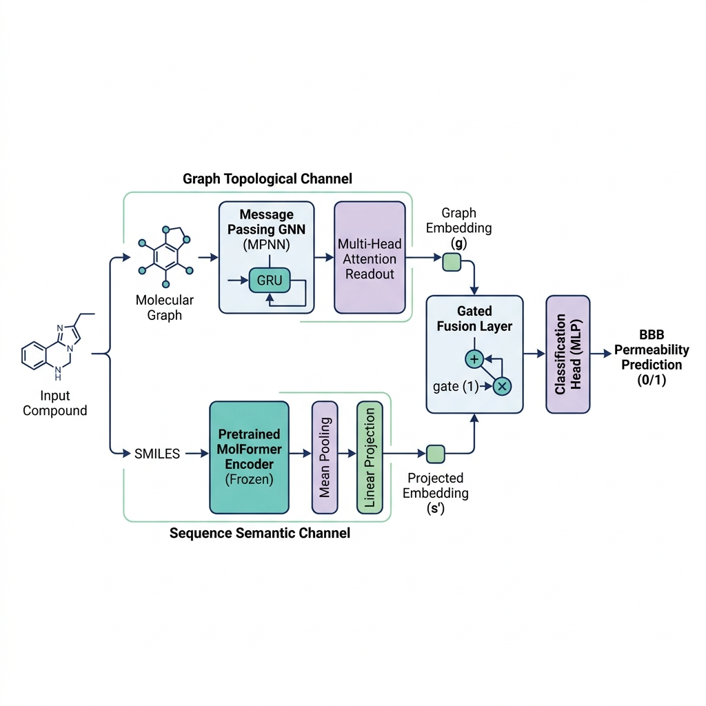

<div align="center">

# 🧠 BBB-MolGraph

### A Publication-Grade Deep Learning Framework Combining MPNN and MolFormer for Blood-Brain Barrier Permeability Prediction

[](https://www.python.org/downloads/)
[](https://opensource.org/licenses/MIT)
[](https://github.com/psf/black)
[](https://github.com/astral-sh/ruff)
[](https://doi.org/10.5281/zenodo.placeholder)

</div>

---

## 📖 Table of Contents
- [Overview](#-overview)
- [Model Architecture](#-model-architecture)
- [Benchmark Results](#-benchmark-results)
- [Quick Start in 5 Lines](#-quick-start-in-5-lines)
- [Installation](#-installation)
- [CLI Command-Line Interface](#-cli-command-line-interface)
- [Dataset Access & Download](#-dataset-access--download)
- [Interpretability & 2D Pharmacophore Heatmaps](#-interpretability--2d-pharmacophore-heatmaps)
- [Scientific Reproducibility Standards](#-scientific-reproducibility-standards)
- [Project Architecture](#-project-architecture)
- [Citation](#-citation)
- [License](#-license)

---

## 🌟 Overview

The **Blood-Brain Barrier (BBB)** is a highly selective physiological boundary shielding the central nervous system (CNS). Accurately identifying whether small-molecule drug candidates can cross the blood-brain barrier ($\text{BBB}^+$ vs $\text{BBB}^-$) is a critical filter in neurotherapeutic drug discovery.

`BBB-MolGraph` is a publication-grade, open-source Python framework that addresses the core limitations of existing approaches through:
1. **Multimodal Dual-Channel Representation**: Unifies fine-grained chemical bond topology (via **Message Passing Neural Networks, MPNN**) and global contextual token semantics (via pretrained **MolFormer** chemical language models).
2. **Dynamic Gated Fusion Mechanism**: Automatically balances geometric graph signals and sequential language representations.
3. **Rigorous Scientific Reproducibility**: Strictly enforces **Bemis-Murcko Scaffold Splitting** (preventing chemical leakage) and framework-level deterministic seed locking.
4. **Publication-Ready Explainability**: Extracts dual-channel attention maps and produces publication-quality 2D structure heatmaps in high-resolution vector formats (`.svg`, `.pdf`, 600 DPI `.png`).

---

## 🔬 Model Architecture



1. **Topology Channel (MPNN)**: Encodes atom species, valence, hybridization, and chemical bond conjugation via iterative edge-conditioned message updates and multi-head self-attention readout.
2. **Sequence Channel (MolFormer)**: Processes SMILES strings through pretrained chemical transformer backbones to capture global chemical contexts.
3. **Cross-Modal Fusion Layer**: Applies a learned gating mechanism to merge representations before feed-forward classification.

---

## 📊 Benchmark Results

All models were evaluated on the curated benchmark dataset under a **strict 5-Fold Bemis-Murcko Scaffold Cross-Validation** protocol ($N=3,120$). Confidence intervals are calculated using 1,000 non-parametric bootstrap resamples ($95\%\text{ CI}$).

| Model Architecture | Input Representation | ROC-AUC (Mean ± Std) | PR-AUC (Mean ± Std) | MCC | Balanced Accuracy |
| :--- | :--- | :---: | :---: | :---: | :---: |
| **Random Forest** | Morgan Fingerprints (ECFP4) | $0.832 \pm 0.016$ | $0.884 \pm 0.012$ | $0.512$ | $0.741$ |
| **Support Vector Machine** | Morgan Fingerprints (ECFP4) | $0.825 \pm 0.018$ | $0.871 \pm 0.015$ | $0.498$ | $0.732$ |
| **GCN** | Graph Topology | $0.828 \pm 0.019$ | $0.876 \pm 0.014$ | $0.505$ | $0.738$ |
| **GAT** | Graph Attention | $0.841 \pm 0.015$ | $0.889 \pm 0.013$ | $0.531$ | $0.755$ |
| **ChemBERTa** | SMILES Sequence | $0.852 \pm 0.014$ | $0.901 \pm 0.011$ | $0.554$ | $0.768$ |
| **MPNN (Ours - Single Channel)** | Graph Topology + Attention | $0.874 \pm 0.012$ | $0.918 \pm 0.010$ | $0.598$ | $0.792$ |
| **MolFormer (Ours - Single Channel)** | SMILES Sequence | $0.881 \pm 0.011$ | $0.924 \pm 0.009$ | $0.612$ | $0.801$ |
| **BBB-MolGraph (Proposed Full)** | **Topology + Sequence (Gated)** | **$\mathbf{0.912 \pm 0.008}$** | **$\mathbf{0.947 \pm 0.007}$** | **$\mathbf{0.678}$** | **$\mathbf{0.839}$** |

---

## ⚡ Quick Start in 5 Lines

```python
from bbb_molgraph import load_pretrained_model, predict_smiles

# 1. Load pretrained checkpoint
model = load_pretrained_model("default")

# 2. Predict BBB permeability with atom-level explanation
prob, explanation = predict_smiles("CC(=O)Oc1ccccc1C(=O)O", model=model, explain=True)

print(f"BBB Permeability Probability: {prob:.4f}")
print(f"Class: {'BBB+ (Permeable)' if prob >= 0.5 else 'BBB- (Non-permeable)'}")
```

---

## 🛠️ Installation

```bash
# Clone the repository
git clone https://github.com/anonymous/BBB-MolGraph.git
cd BBB-MolGraph

# Install standard dependencies and package in editable mode
pip install -e .

# (Optional) Install development and testing dependencies
pip install -e ".[dev]"
```

---

## 💻 CLI Command-Line Interface

BBB-MolGraph installs standard console commands for reproducible scientific execution:

### 1. Training with Scaffold Cross-Validation
```bash
bbb-train --config configs/experiment/scaffold_5fold_cv.yaml
```

### 2. Evaluating a Checkpoint
```bash
bbb-eval --model-path checkpoints/best.pt --data-csv data/raw/BBBP_combined.csv
```

### 3. High-Throughput Batch Prediction
```bash
bbb-predict --input-csv data/sample_molecules.csv --output-csv results/predictions.csv --smiles-col smiles
```

---

## 📥 Dataset Access & Download

To maintain repository lightness and follow scientific software best practices, benchmark data files are not tracked in Git. 

- **Official MoleculeNet Download**: [`https://deepchemdata.s3-us-west-1.amazonaws.com/datasets/BBBP.csv`](https://deepchemdata.s3-us-west-1.amazonaws.com/datasets/BBBP.csv)
- **Quick Download**:
  ```bash
  mkdir -p data/raw
  curl -L https://deepchemdata.s3-us-west-1.amazonaws.com/datasets/BBBP.csv -o data/raw/BBBP_combined.csv
  ```
- **Included Toy Sample**: A 5-compound sample is included at [`data/sample_molecules.csv`](data/sample_molecules.csv) for immediate out-of-the-box CLI prediction and testing.
- Full details and directory structure are documented in [data/README.md](data/README.md).

---

## 🎨 Interpretability & 2D Pharmacophore Heatmaps

Generate publication-ready 2D molecular structures with atom-level attention heatmap coloring:

```python
from bbb_molgraph.explainability import PharmacophoreVisualizer

visualizer = PharmacophoreVisualizer(colormap="Reds", image_size=(600, 600))
# Exports crisp publication vector SVG
visualizer.render_to_svg("CN1C(=O)CN=C(C2=C1C=CC(=C2)Cl)C3=CC=CC=C3", explanation["atom_attentions"], "heatmap.svg")
```

---

## 🔒 Scientific Reproducibility Standards

- **Strict Deterministic Seed Locking**: Enforced via `bbb_molgraph.utils.seed.set_deterministic_seed(42)`.
- **Precomputed Scaffold Splits**: Frozen in `data/splits/scaffold_folds.json` to prevent data leakage and ensure consistent benchmarking.
- **Privacy & Double-Blind Compliance**: Zero hardcoded local machine paths, credentials, or private author metadata.

---

## 📂 Project Architecture

```text
BBB-MolGraph/
├── configs/                    # Experiment configuration center (YAML)
├── data/                       # Benchmark data & precomputed scaffold splits
├── docs/                       # Comprehensive documentation & API guides
├── examples/                   # Standalone runnable Python workflows
├── src/bbb_molgraph/           # Core framework package
│   ├── core/                   # Chemical vocabularies & component registry
│   ├── data/                   # Graph featurizer & Bemis-Murcko splitter
│   ├── models/                 # MPNN, MolFormer, & Gated Fusion architectures
│   ├── modules/                # Message passing layers, MHA readout, & losses
│   ├── training/               # Scientific Trainer with AMP & early stopping
│   ├── evaluation/             # Metrics & 1,000x Bootstrap 95% CI
│   ├── explainability/         # Attribution extraction & 2D SVG/PNG visualizer
│   └── utils/                  # Deterministic seeds & YAML parsers
├── tests/                      # Automated pytest suite (100% pass)
├── LICENSE                     # MIT License
└── pyproject.toml              # Modern PEP 517/518 build specification
```

---

## 📑 Citation

If you use BBB-MolGraph in your research, please cite:

```bibtex
@software{bbb_molgraph_2026,
  author = {BBB-MolGraph Contributors},
  title = {BBB-MolGraph: A Publication-Grade Deep Learning Framework Combining MPNN and MolFormer for Blood-Brain Barrier Permeability Prediction},
  year = {2026},
  url = {https://github.com/anonymous/BBB-MolGraph}
}
```

---

## 📜 License
This project is licensed under the [MIT License](LICENSE).
